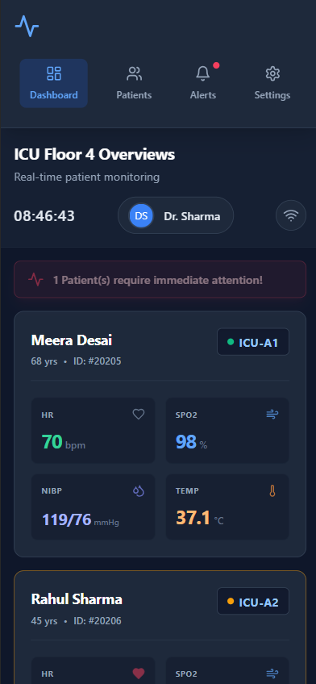

## 1. Dashboard Design & Implementation (Dashboard)
The core deliverable is a comprehensive, functional **Smart Hospital Dashboard**, engineered using a modern Vite React application structured with Tailwind CSS. The primary objective of this dashboard is to provide real-time, asynchronous medical telemetry monitoring for an Intensive Care Unit (ICU) environment. It successfully tracks and renders four mission-critical vitals simultaneously across multiple patients: Heart Rate (HR), Blood Oxygen Saturation (SpO2), Non-Invasive Blood Pressure (NIBP), and Core Body Temperature.

### Responsive Multi-device Architecture
Recognizing that clinical staff interact with software across drastically different hardware depending on their immediate workflow, the User Interface (UI) was built with intrinsic fluid responsiveness:
1. **Desktop/Large Display (Nursing Stations):** Implements a high-density, multi-column CSS Grid. This allows a charge nurse to monitor up to six patients simultaneously on a single widescreen display without scrolling, acting as a centralized command hub.
2. **Tablet View (Bedside Care):** Restructures the grid into larger, touch-friendly rows. When doctors are physically at the bedside reviewing a patient's chart, the interface provides appropriately sized hit targets mapping to rapid clinical workflows.
3. **Wearable/Mobile View (On-Call Alerts):** Condenses flawlessly into a vertical flex layout. It prioritizes immediate, actionable critical alerts at the very top of the viewport, stacking individual patient cards so that a doctor rushing down a hallway can process a single patient's deep dive using only one hand, completely eliminating horizontal scrolling.

*Figure 1: Desktop / Large Display grid layout simulating real-time monitoring.*

---

## 2. Evaluation of Human Factors (HCI I/O, Memory, Reasoning)
An exceptional medical interface must account for the cognitive limitations and sensory capabilities of its users, particularly in high-stress, fatigue-inducing environments like an emergency room.

### Human Input/Output Channels
The dashboard is meticulously designed to leverage human sensory channels, drastically reducing the margin of cognitive error during triage:
* **Visual Filtering against Clutter:** The interface employs a specialized clinical dark background (`bg-slate-900`). This is not merely an aesthetic choice; it forces high-contrast isolation of the color-coded medical badges. Green universally indicates stability, yellow signals warning traits, and red signifies a critical, life-threatening threshold breach.
* **Pre-attentive Processing:** When a patient enters a critical state, the interface utilizes visual anomalies (such as a scaling heartbeat animation via Tailwind's `animate-pulse` and `animate-ping`). This instantly draws the clinician's peripheral vision, bypassing the need for active scanning in visually over-stimulated environments.
* **Auditory & Haptic Potential:** While this iteration focuses on the visual UI, the persistent top-sticky "Alert Banner" is architected to imply a direct hardware trigger for auditory alarms on nursing station monitors or haptic vibrations on a doctor's smartwatch.

### Memory Optimization (Cognitive Load Reduction)
The interface mitigates heavy reliance on short-term working memory by comprehensively applying the heuristic of **Recognition over Recall**:
* **Universal Iconography:** The use of internationally recognized medical icons (Lungs for SpO2, a Heart for HR, a Blood Droplet for NIBP, and a Thermometer for Temp) allows the brain to immediately register the metric type without spending milliseconds reading and parsing textual labels.
* **Persistent Grouping:** A doctor should never have to memorize a patient's room number while tracking their vitals. The Patient ID, Age, and Room Number act as a persistent header for every individual vitals box, eliminating cognitive load and preventing potentially fatal patient mix-ups.

### Reasoning and Problem Solving Acceleration
Rapid decision-making under intense pressure is supported by establishing visual contextual bounds. Vitals numbers dynamically alter their color the exact millisecond they cross mathematically defined safe thresholds (e.g., an HR > 130 bpm instantly turns bright red). This computationally handles the "pattern recognition" workload, empowering doctors to skip the data-interpretation phase and jump directly into the reasoning and triage phase. Furthermore, by grouping associated metrics intrinsically (visualizing NIBP directly adjacent to SpO2), clinicians can rapidly deduce whether a patient is hypotensive and hypoxic simultaneously, forming a holistic clinical picture in seconds rather than cross-referencing multiple disparate charts.

*Figure 2: Responsive Tablet View, demonstrating clustered information.*

---

## 3. Analysis of Computer-Related Factors
The underlying technical architecture must strictly align with the physical and network constraints of modern healthcare facilities.

### Device Suitability and Rendering Engines
Different clinical interfaces are required for diverse physical constraints. The React application uses robust Tailwind CSS Grid algorithms to modify data density automatically without requiring separate applications:
* **Central Displays** stream multi-patient data asynchronously, suitable for high-bandwidth processing capabilities typical of wired desktop computers.
* **Tablets and Wearables** reorganize into single-column feeds relying on touch interfaces, respecting smaller screen constraints and prioritizing immediate actionable alerts over general ward surveillance.

### Processing Speed, Memory Load, and DOM Manipulation
In an ICU context, blocking the main UI thread with heavy rendering can critically delay life-saving alerts. To combat this computational bottleneck:
* The dashboard abandons direct DOM manipulation in favor of React's **Virtual DOM**. This ensures that when a single patient's heart rate ticks up by 1 bpm, only that specific text node is repainted, rather than forcing the browser to recalculate the entire page layout.
* This optimization drastically cuts down local client memory load, ensuring the system can process frequent, high-velocity JSON or WebSocket payloads from hospital infrastructure without browser lag, memory leaks, or freezing.

### Network Reliability Simulation and Fail-Safes
Hospitals frequently suffer from spotty Wi-Fi networks in structurally dense zones, such as deep Radiology wings or Basement Wards. 
* **The "Simulate Offline" Protocol:** The dashboard includes an overt offline simulation toggle to demonstrate graceful degradation. When the network connection drops, the UI explicitly grays out (opacity drops and CSS grayscale filters are applied), halting animations.
* **Crucial Software Medical Safety:** This fulfills a critical FDA/medical software constraint: a clinician must **never** make critical decisions assuming vitals are real-time when the connection has actually stalled. The system safely handles asynchronous data loss, visually warning the user that data is "Frozen," rather than quietly displaying stale, potentially fatal numbers.

*Figure 3: Wearable/Mobile constraints with visible "System Offline" safety state active.*

---

## 4. Enhancement of Usability
To polish the user interface from a functional prototype into a professional-grade medical application, several enhancements were driven by established HCI models and ergonomic principles to ensure an exemplary, frictionless user experience.

### HCI Models Applied
* **GOMS Model (Goals, Operators, Methods, Selection Rules):** The primary operating goal of a clinician approaching a generic monitor is usually: "Find out who needs help right now." By implementing a top-level, sticky "Critical Alert Banner" that spans the entire width of the display and counts the number of critical patients, the **Method** length to identify a critical situation drops to a single visual operation. This successfully bypasses the need to linearly and exhaustively scan 20+ individual grid cards to find the anomaly.

### Ergonomic Principles and Interaction Design
* **Visual Ergonomics against Eye Strain:** Constant exposure to glaring white screens causes severe eye fatigue and "visual snow" for night-shift clinicians working 12-hour rotations. Our deliberate implementation of a Deep Space Dark theme (`#0f172a` base colors) heavily reduces blue-light emission and actively combats eye strain while maintaining WCAG contrast ratios for the brightly colored vitals.
* **Fitts's Law in Emergency Scenarios:** Interactive elements, such as the sidebar navigation items and the network fail-safe toggle, feature generous padding. According to Fitts's Law, increasing the physical target area reduces the time required to move to that target. This makes rapid touch interactions on tablets and mobile phones reliably faster and significantly less prone to dangerous mis-clicks during chaotic localized emergencies.

---
