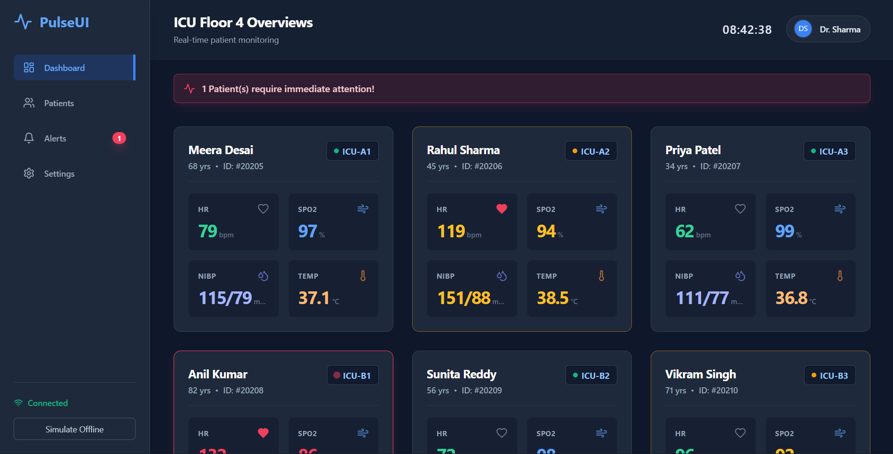

# HCI Assignment 1: Smart Hospital Dashboard

**Name:** Harshal Patel  
**UID:** 22BAI71187  
**Section/Class:** 22AML- 6A  
**Course:** BE-CSE-AIML  

---

## 1. Dashboard Design & Implementation (Dashboard)
This project features a fully functional, highly responsive, and interactive **Smart Hospital Dashboard** developed using modern web technologies (React via Vite and Tailwind CSS). The dashboard successfully fulfills the core requirements by simultaneously tracking four critical vitals: Heart Rate (HR), Blood Oxygen (SpO2), Non-Invasive Blood Pressure (NIBP), and Temperature across multiple patients. 

### Responsive Multi-device Views
The User Interface seamlessly scales across standard hardware typical in a hospital environment:
1. **Desktop/Large Display:** Displays a high-density grid showing all patient metrics on a single screen without needing navigation, perfect for central nursing stations.
2. **Tablet View:** Restructures for touch navigation with appropriately sized hit targets mapping clinical workflows.
3. **Wearable/Mobile View:** Condenses perfectly into a vertical flex layout prioritizing immediate critical alerts and single-patient deep dives without any horizontal scrolling.

*Figure 1: Desktop / Large Display grid layout simulating real-time monitoring.*

---

## 2. Evaluation of Human Factors (HCI I/O, Memory, Reasoning)

### Human I/O Channels
The dashboard is designed to heavily utilize human sensory channels to drastically reduce the margin of cognitive error:
* **Visual Filtering:** The interface leverages a clinical dark background (`bg-slate-900`) with high-contrast, color-coded medical badges. Green indicates stability, yellow indicates warning traits, and red signifies a critical threshold break.
* **Pre-attentive Processing:** Critical metrics feature a pulsing visual anomaly (e.g., a scaling heartbeat animation via Tailwind's `animate-pulse` and `animate-ping`). This draws the clinician's peripheral vision immediately, addressing visually over-stimulated environments.
* **Auditory & Haptic Potential:** The top sticky alert banners imply a direct hardware trigger for auditory alarms on nursing stations or haptic vibrations on doctor wearables.

### Memory Optimization
The interface mitigates heavy reliance on short-term working memory by comprehensively applying the heuristic of **Recognition over Recall**:
* Industry-standard Iconography (Lungs for SpO2, Heart for HR, Droplet for NIBP) immediately registers the metric without needing to read textual labels.
* Information is persistently grouped. A doctor does not have to remember a patient's room number; the ID, Age, and Room act as a persistent header for every vitals box to eliminate cognitive load.

### Reasoning and Problem Solving
Rapid decision-making under intense pressure is supported via contextual bounds. Vitals numbers visually change color the precise moment they cross mathematically safe thresholds (e.g., HR > 130 bpm turns red). This handles the "pattern recognition" workload computationally, allowing doctors to skip the interpretation phase and jump directly to the reasoning/triage phase.

*Figure 2: Responsive Tablet View, demonstrating clustered information.*

---

## 3. Analysis of Computer-Related Factors

### Device Suitability
Different clinical interfaces are required for diverse physical constraints. The React application uses robust Tailwind CSS Grid algorithms to modify data density automatically:
* **Central Displays** stream multi-patient data asynchronously, suitable for high-bandwidth processing capabilities.
* **Tablets and Wearables** reorganize into single-column feeds, respecting smaller screen constraints and prioritizing immediate actionable alerts over general ward surveillance.

### Processing Speed and Memory Load
In an ICU context, blocking the main UI thread can critically delay life-saving alerts. To combat this:
* The dashboard utilizes React's Virtual DOM optimized rendering rather than forcing standard browser repaints. 
* This drastically cuts down local client memory load, ensuring the system can process frequent, high-velocity JSON/WebSocket payloads from hospital infrastructure without browser lag or hanging.

### Network Reliability Simulation
Hospitals frequently suffer from spotty Wi-Fi networks in structurally dense zones (e.g., Radiology or Basement Wards). 
* **The "Simulate Offline" Feature:** The dashboard includes an overt offline simulation toggle. When the network drops, the UI explicitly grays out (opacity drops and grayscale filters are applied) and explicitly warns that the data is "Frozen".
* This fulfills a critical software medical safety constraint: a clinician must *never* make critical decisions assuming vitals are real-time when the connection has actually stalled.

*Figure 3: Wearable/Mobile constraints with visible "System Offline" safety state active.*

---

## 4. Enhancement of Usability

To finalize the UI, several enhancements were driven by established HCI models and ergonomic principles to ensure an exemplary user experience:

### HCI Models Applied
* **GOMS Model (Goals, Operators, Methods, Selection Rules):** The primary goal of a clinician approaching a screen is usually "Find who needs help." By adding a top sticky "Alert Banner" spanning the width of the display, the *Method* length to identify a critical patient drops to a single visual operation, bypassing the need to linearly scan 20+ individual grid cards.

### Ergonomic Principles
* **Visual Ergonomics:** Constant glaring white screens cause severe eye fatigue for night-shift clinicians. Our use of Deep Space Dark themes (`bg-slate-900` surface colors) heavily reduces blue-light eye strain over a 12-hour shift.
* **Fitts's Law:** Interactive elements (like the sidebar navigation items and the network toggle) feature generous padding, increasing the physical target area. This makes rapid touch interactions on tablets and mobile phones reliably faster and significantly less prone to mis-clicks during localized emergencies.

---

## 5. Deployment and Codebase
The codebase has been deployed live using Vercel CI/CD for instant accessibility.

* **Live Demo (Vercel):** [https://smart-hospital-eight.vercel.app/](https://smart-hospital-eight.vercel.app/)
* **Source Code (GitHub):** [https://github.com/HarshalPatel1972/HCI-Assignment-1](https://github.com/HarshalPatel1972/HCI-Assignment-1)

---
*End of Report*
